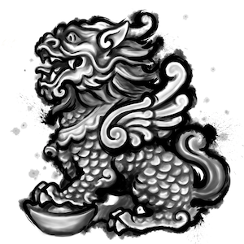

# An Open-Source Crypto Currency Exchange

### What is Peatio?

Peatio is the transliteration of Chinese "[貔貅](http://en.wikipedia.org/wiki/Pixiu)".

"貔貅" is a mythical creature in Chinese culture that is often associated with wealth, protection, and good fortune. It is typically depicted as a hybrid creature with the body of a lion and the head of a dragon, along with various other features such as horns, wings, and hooves.

