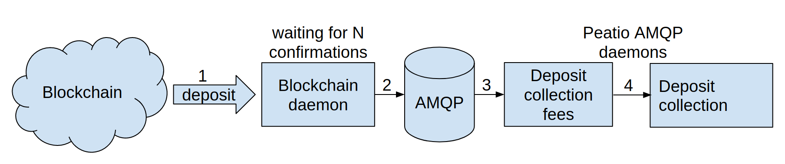
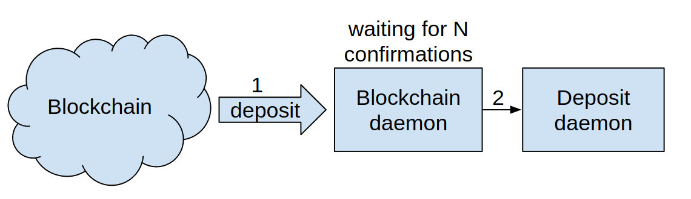

# Peatio deposit flow
## Previous version
In previous version we had deposit collection flow based on amqp daemon (deposit_collection_fees, deposit_collection)

Legacy deposit process diagram:

1. Blockchain daemon process blocks and filter platform deposits.
2. We are waiting for the N number of confirmations.
3. Blockchain daemon produces AMQP message for deposit_collection_fees daemon.
4. deposit_collection_fees daemon trying to collect fees if needed (erc20 case) and after collection immediately produce a message for the next daemon (deposit_collection).

deposit_collection daemon processing message and trying to collect deposit depending on the deposit spread.

The main problem for this approach that we don't wait till the transaction that we generated in the deposit_collection_fees daemon successfully executed and we are failing on deposit collection in the last step (it happens mostly for each erc20 deposit). Also, there is some chance that we can miss amqp message due to server instability.

## New deposit collection flow based on SQL worker

We decided to remove to AMQP base deposit daemons and create a new deposit daemon that will work on deposit states changes and will prevent immediate proceeding of erc20 deposits.

New deposit process diagram:

1. Blockchain daemon process blocks and filter platform deposits.
2. We are waiting for the N number of confirmations.
3. In the deposit daemons we select each 60s deposits with state `processing` and `fee_processing`.
4. For `processing` deposits we are checking if plugin implement method `prepare_deposit_collection!` if it doesn't we immediately process the deposit and collect deposit to the `hot`, `warm`, `cold` wallets. If plugin implement method `prepare_deposit_collection!` daemon processing of collection fees and change deposit state to `fee_processing`.
For deposits with `fee_processing` state, we select each minute deposits that have `updated_at` older than 5 minutes and process them. With time condition we are sure that fee transaction has already been executed.

## 3.1 Deposit flow
In 3.1 release we are intoducing new feature - recording expenses on blockchain transactions.

Deposits now have 3 new states: `fee_collecting`, `fee_collected` and `collecting`

### Coin deposit flow:
Accepted -> Processing -> Collecting -> Collected

Now, instead of marking deposit as collected right after sending collection transaction, we put it into `collecting` state.
Then, as soon, as Peatio process block with this transaction, we confirm transaction success, record expenses related to fee we spent and put deposit in `collected` state.

### Token(ERC-20) deposit flow:
Accepted -> Processing -> Fee_Collecting -> Fee_Collected-> Collecting -> Collected

#### Fee collecting:
After sending fees from Fee wallet to user payment address, instead of waiting for 5 minutes, we are waiting for the block with this transaction to being processed by Blockchain daemon.
As soon, as Peatio process target block, deposit state is changed to Fee_Collected.

##### Fee collected:
When fees arrives to user payment address, we are creating deposit collection transaction and change deposit state to `collecting`. After that, the flow is the same as for Coin deposit.