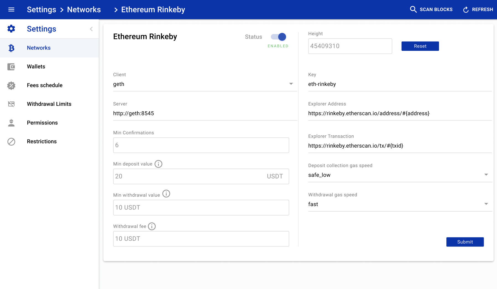
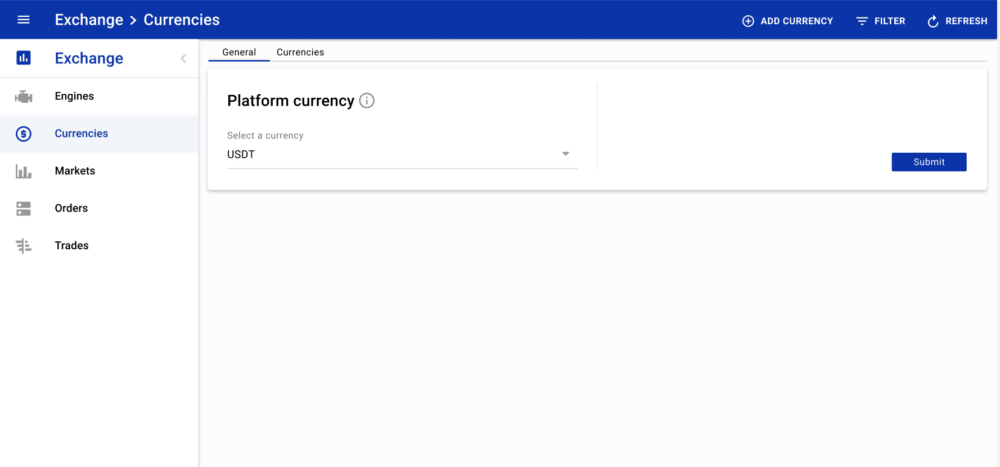
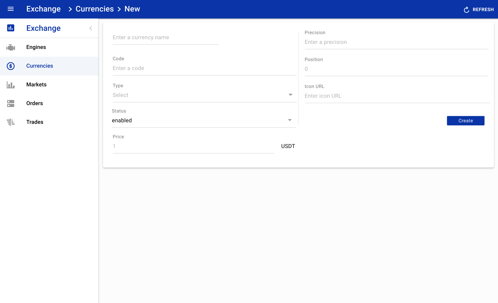
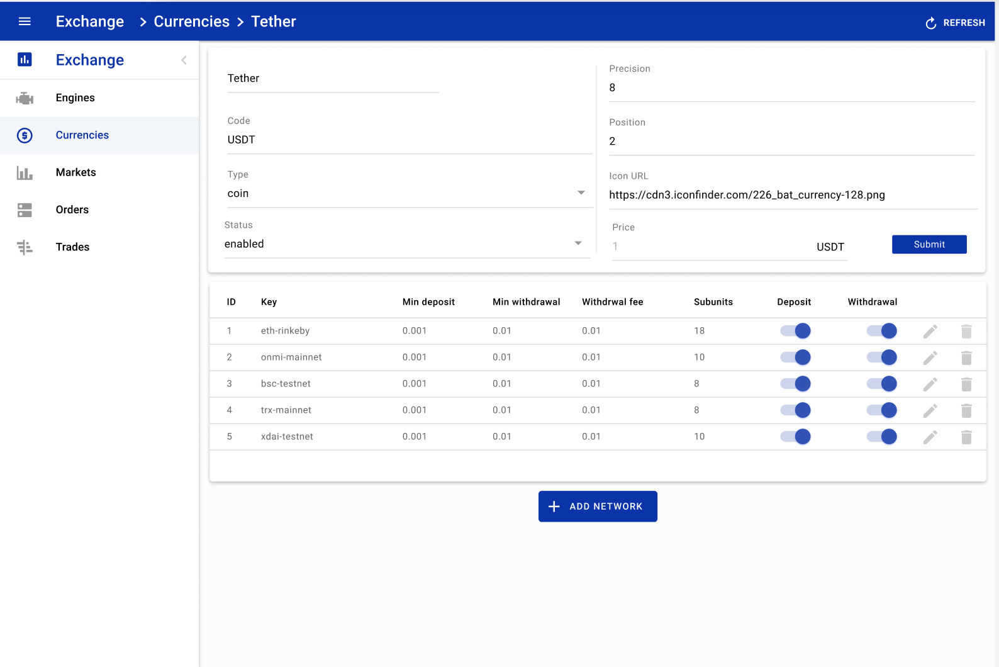
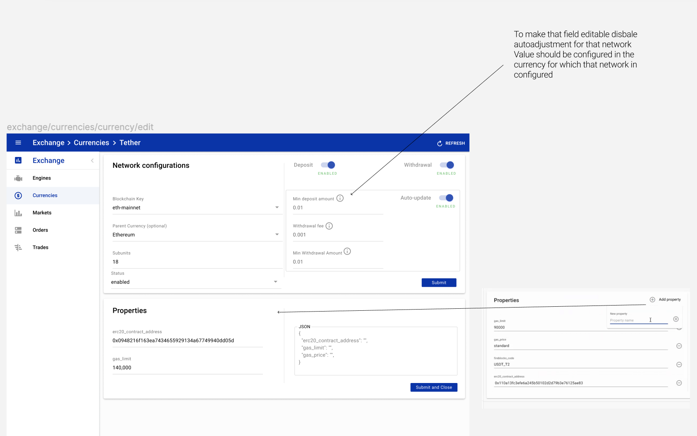

# Multi networks currency

Now almost all currencies are supported on many different blockchains.
The most common example being USDT which is supported on:

- OMNI
- Ethereum
- TRON
- BSC
- ...

Even BTC and ETH are tokenized on Ethereum and others blockchains

## Platform Configurations

### Blockchains

New fields added to blockchain configuration, now you can configure min deposit amount, withdraw fee, min withdraw amount on blockchain level in plarform currency

|Field|    | Default Values | Examples | Description|
|---------|---------|---------|---------|--------|
|Name | required | - | Ethereum Rinkeby | shows descriptive name of a blockchain node|
|Blockchain Key | required | - | eth-rinkeby | shows the key name of a blockchain node. Key used as a parameter during the configuration of other platform elements (i.e. BlockchainCurrencies, Wallets)|
|Status| required | disabled | active/disabled | shows the status of a blockchain node |
|Client| required | - | value from dropdown | shows the name of a blockchain client. Some blockchains have more than one blockchain node client that is developing by different teams |
|Server| optional | - | any valid url | field for a node URL with the connection port |
|Min Confirmations| optional | 6 | integer number > 1 | some quantity of blocks that needs to mine after the block with the deposit (withdrawal) transaction. When a deposit (withdrawal) reaches min confirmation number, the platform creates corresponding records in the accounting|
|Height| required | - | integer number > 1| shows the block height of a corresponding blockchain |
|Protocol| required | - | BEP-2 | shows blockchain protocol |
|Description| optional | - | any valid text | shows description about blockchain node |
|Warning| optional | - | any valid text  | shows specific info about blockchain node |
|Explorer Address| optional | - |	https://testnet.smartbit.com.au/address/#{address} | shows explorer address url of your network |
|Explorer Transaction| optional | - | https://testnet.smartbit.com.au/tx/#{txid} | shows explorer transaction url of your network|
|Min Deposit Amount| optional | 0 | positive number| shows minimum deposit amount for the corresponding currency. If a user deposits less than that amount the platform doesn't recognize it as a deposit and do nothing with that amount (in platform currency)|
|Withdraw Fee| optional | 0 | positive number | shows fee amount that platform takes from a withdrawal of corresponding currency (in platform currency) |
|Min Withdraw Amount| optional | 0| positive number| shows minimum amount of a corresponding blockchain that platform allows to withdraw (in platform currency) |
|Deposit Collection Gas Speed| optional | -| safelow < standard < fast | shows deposit collection speed, only for *RC-20 transactions, when system transfers funds from fee wallet to user deposit address |
|Withdrawal Gas Speed| optional | - | safelow < standard < fast | shows withdrawal gas speed |



### Currencies

System use platform currency, to estimate min deposit amount, withdraw fee, min withdraw amount if auto update configuration enabled </br>
Periodic job will recalculate all amounts every 5 min due to mid market price </br>
You can setup platform currency with ENV variable `PEATIO_PLATFORM_CURRENCY`, be sure you have this currency seeded in your configuration </br>
Platform currency change is better to do at the begging of the platform configuration. </br>


|Field|    | Default Values | Examples | Description|
|---------|---------|---------|---------|--------|
| Name| required| - | Ethereum | the name of a currency |
| Code| required | - | eth | currency ticker, broadly known abbreviation (ie. Ethereum = ETH, Bitcoin = BTC, etc.)|
| Type | required | - | coin/fiat | the type of a currency |
|Status| required | - | active/disabled/hidden | represents currency visibility for users. Visibility has three statuses: active -  currency is fully available to the general public; disabled - currency is not available at the user side; hidden - information about that currency is present at the API response but it’s rendered only to defined list of roles, can be used for testing proposes during the listing |
|Price| required | - | positive number | price of the currency in the platform currency |
|Precision| required | - | positive number | currency precision on the user interface. Precision field accepts values from 0 till 8 included |
|Position| required | - | positive number | position of the currency in the currency list |





### Blockchain Currencies

If auto update configuration enabled, network configurations for values like min deposit amount, withraw fee, min withdrawal amount will be calculated next way:

```
min_deposit_amount = (min deposit amount from blockchain configurations) / (currency price)

withraw_fee = (withraw fee from blockchain configurations) / (currency price)

min_withdrawal_amount = (min withdrawal amount from blockchain configurations) / (currency price)
```

Currency price will be fetched from the platform market CCY/USDT (if USDT is the platform currency)

If there is no market pair CCY/PLATFORM_CURRENCY, system will use price from currency configuration price set by admin

|Field|    | Default Values | Examples | Description|
|---------|---------|---------|---------|--------|
| Blockchain Key | required| - | eth-rinkeby | drop-down menu listing blockchain nodes supported by the platform |
| Parent Currency | optional| - | currency_code | drop-down menu listing blockchain nodes supported by the platform |
| Subunits | required| - | positive number | denomination of currency. Cryptocurrencies can have different subunits number. This is a technical parameter that was set by currency creators |
| Deposit enabled | required| true | true/false | switcher that helps to manage currency deposit functionality on a specific network |
| Withdrawal enabled | required| true | true/false | switcher that helps to manage currency withdrawal functionality on a specific network |
| Auto-update enabled | required| true| true/false | functionality that manage auto-updates of financial parameter based of the currency price and general configurations of that blockchain network (module Settings, section Networks) |
| Min deposit amount | optional| 0 | positive number | minimum amount of the currency in the absolute value that will be recognised by the system as a deposit. Amounts that are lower than min deposit amount won’t be tracked as a deposit on that network. |
| Withdrawal fee | optional| 0 | positive number | amount of that currency that will be charged from a user a flat withdrawal fee on that network |
| Min withdrawal amount | optional| 0 | positive number | minimum amount of the currency in the absolute value that the user can withdraw. Minimum withdrawal should be ≥ the withdrawal fee. |
| Properties | optional | {} | { gas_limit: 21_000, erc20_contract_address: '0x123123b234121'} | currency network properties |


