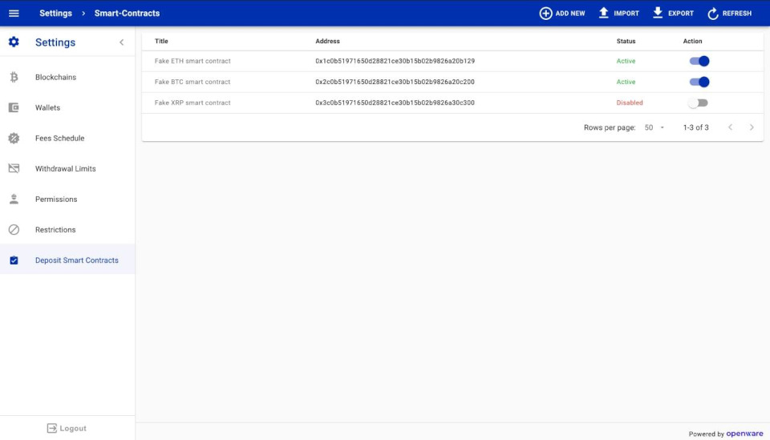

# Whitelisted smart contracts

This doc describes how you can use whitelisted smart contract feature to detect deposits from third party smart contracts.

| Term               | Definition                                                   |
| ------------------ | ------------------------------------------------------------ |
| Description        | The smart contract info.                                     |
| Address            | Address of whitelisted smart contract.                       |
| State              | State of whitelisted smart contract                          |
| Blockchain key     | Identify in which blockchain system will detect deposit from whitelisted smart contract |

There are many third-party smart contracts with which you can send eth or erc-20.

Example of transaction: https://etherscan.io/tx/0xeb92797eb91f53ce7bb68abaf3fd3198980d971dd42f9fcb6eb1272ef3ef2a0e

In this transaction TOM erc-20 (`0xf7970499814654cd13cb7b6e7634a12a7a8a9abc`) was transferred

from `0x095273adb73e55a8710e448c49eaee16fe115527`
to `0xbbd602bb278edff65cbc967b9b62095ad5be23a3`

using `0x6c0b51971650d28821ce30b15b02b9826a20b129` smart contract.

Before Peatio was not able to detect this deposit because the system checks `to` entry in eth raw transaction and
compare it with existing currency smart contracts in DB.

With the Whitelisted smart contracts feature the system will able to detect deposits from third-party smart contracts.

You just need to add it through Tower (Settings tab -> Whitelisted smart contracts) and link it to the right blockchain (via blockchain_key). Also, there is the ability to load CSV files with several smart contracts.



Through rails console:

```ruby
WhitelistedSmartContract.create(description: "New third party contracts", address: "0x6c0b51971650d28821ce30b15b02b9826a20b129", state: "active", blockchain_key: "eth-mainet")
```